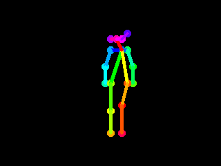

# Imori global site project

an unofficial project

## #001

using OpenPose for Imori dance movie

### Example

29.97fps

### Motion Data (2D)

[Download](i001/motion_data.zip "motion_data.zip")

#### csv format

    sample_image_file,x0,y0,score0,x1,y1,score1,...,x17,y17,score17

    0:  Nose
    1:  Neck
    2:  RShoulder
    3:  RElbow
    4:  RWrist
    5:  LShoulder
    6:  LElbow
    7:  LWrist
    8:  RHip
    9:  RKnee
    10: RAnkle
    11: LHip
    12: LKnee
    13: LAnkle
    14: REye
    15: LEye
    16: REar
    17: LEar

### References

[1] OpenPose : [https://github.com/CMU-Perceptual-Computing-Lab/openpose](https://github.com/CMU-Perceptual-Computing-Lab/openpose)

[2] tf-pose-estimation : [https://github.com/ildoonet/tf-pose-estimation](https://github.com/ildoonet/tf-pose-estimation)
